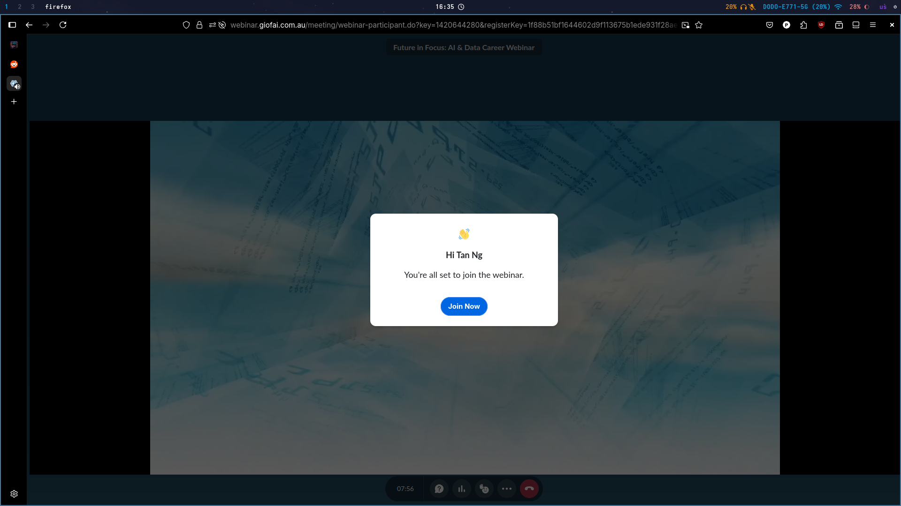

  <!-- Sidebar -->
  

    <h3>📋 Contents</h3>
    <ul style="list-style: none;">
      <li><a style="color: white; text-decoration: none;" href="#activities"><h3>Activities</h3></a></li>
      <ul style="list-style: none;">
        <li><a style="color: white; text-decoration: none;" href="#1"># 1</a></li>
        <li><a style="color: white; text-decoration: none;" href="#2"># 2</a></li>
        <li><a style="color: white; text-decoration: none;" href="#3"># 3</a></li>
        <li><a style="color: white; text-decoration: none;" href="#4"># 4</a></li>
        <li><a style="color: white; text-decoration: none;" href="#5"># 5</a></li>
        <li><a style="color: white; text-decoration: none;" href="#6"># 6</a></li>
        <li><a style="color: white; text-decoration: none;" href="#7"># 7</a></li>
        <li><a style="color: white; text-decoration: none;" href="#8"># 8</a></li>
        <li><a style="color: white; text-decoration: none;" href="#9"># 9</a></li>
        <li><a style="color: white; text-decoration: none;" href="#10"># 10</a></li>
      </ul>
      <li><a style="color: white; text-decoration: none;" href="#reflection"><h3>Reflection</h3></a></li>
      <ul style="list-style: none;">
        <li><a style="color: white; text-decoration: none;" href="#situation-1">Situation 1</a></li>
        <li><a style="color: white; text-decoration: none;" href="#situation-2">Situation 2</a></li>
      </ul>
    </ul>
  

  <!-- Main content -->
  

  <h3 align="center">Employability Profile</h3>
  
Tan Loc Nguyen

  <h2 id="activities">Activities</h2>

  <h3 id="1"> # 1: Logic apps Developer Experience - What's new on 13rd of May 3p.m-5p.m</h3>
    
    
In this event, Wagner shared tips and tricks while showcasing his app deployment on one of his "Logic Apps" projects

  <h3 id="2"> # 2: How to Earn £5K+/Month Using A.I on 15 th of May 6.60p.m-7.30pm</h3>
  
  
This free workshop from offers a step-by-step blueprint to generate incomes using AI-powered strategies, and provides a personalized action plan. It focuses on current trends and offers an interactive session

  <h3 id="3"> # 3: Develop powerfull apps with SQL database in Fabric (feat. the Product Group!) on 21st of May 12p.m-2p.m</h3>
  
  
Introduce Sql in Fabric. GraphQL examples. The event walked through the process of developing, deploying and managing a SQL database in Fabric.

  <h3 id="4"> # 4: Digital Goldmine: Turn your Website into a Revenue-Boosting Machine! on 22nd of May 3.30p.m-4.30p.m</h3>
  

    
    
  

  
This webinar, led by Dr. Edward Clinger, show how to increase sales by identifying common website mistakes and implementing proven strategies for engagement and conversion.

  <h3 id="5"> # 5: Curios About AI coding? Let's Explore Copilot Together! Beginner-Friendly! on 26th of May 4.30pm-5.30p.m</h3>
  
  
learn how to use Copilot for basic tasks and product idea sketching through live walkthroughs, with clear explanations and a focus on building confidence to use AI as a learning tool.
  

  
  <h3 id="6"> # 6: AI for Everyone | Master AI Tools (Glasp & ChatDOC) on 27st of May 6p.m-7p.m</h3>
  
  
intrduce ai tools that can help everyday tasks. utilizing glasp to summerize the contents of a Youtube video. Tools like Chatdoc are capable of summarizing documents.
  

  <h3 id="7"># 7: Future in Focus: AI & Data Career Webinar on 28th of May 4.30pm-5.30p.m</h3>
  

    
    
  

  
This session provides valuable insights into the latest AI and Data industry trends, offering roadmaps for career development and expert tips on upskilling, aiming to give attendees clarity, confidence, and clear direction for their future in this rapidly evolving field.

  <h3 id="8"> # 8: Gen AI - Prompts, News, Agents and Vibe Coding Discussion on 2nd of June 6.30p.m-7.30p.m</h3>
  
  
This GenAI meetup offers discussions on various AI-related topics, including prompt engineering for LLMs like ChatGPT to achieve better results, an overview of AI tools and news, a comparison of LLM models, AI Agents, and local AI model running.

  <h3 id="9"># 9: Adelaide Microsoft Copilot User on 4th of June 3p.m-5p.m</h3>
  
  
the event from Adelaide MS Copilot User Group discuss and explain how to prompt in the copilot chat to achieve result that you expected and examples how you can use it in business setting. 

  <h3 id="10"># 10: June 2025 - Order from chaos - Importing brownfield Azure apps into Terraform on 10th of June 3p.m-5p.m</h3>
  
  
This presentation desmontrate how to transition existing Azure applications, often built without Infrastructure, into Terraform. the session demonstrate how to use new Terraform features and the Azure Export for Terraform CLI tool to confidently manage your infrastructure.

  <h2 id="reflection">Reflection</h2>
    
Before these events, I'd have my personal and professional skills as a developing computer science student, limited with theoretical knowledge and basic practical experience. I'd feel confident in my technical learning but less so about applying it in business or navigating industry trends. My professional skills, while growing through academic group work, would lack real-world exposure.   
    The "Financial Freedom Club" workshops, especially on using AI for generate income and change website's design , would have broaden my view. I understood the direct financial potential of tech skills and entrepreneurial value beyond traditional employment. The AI & Data career guidance and prompt engineering discussions would directly address my career uncertainties, offering clear roadmaps and strategies. Finally, the session on transfer Code into Terraform platform would highlight the critical importance of robust deployment practices, emphasizing the clear value of structured, maintainable systems with not only functionality. These experiences would better show a more dynamic and entrepreneurial tech career path, where continuous learning and strategic skill application are highly relevant for a final-year CS student like me.

  <h3 id="situation-1">Situation 1</h3>
  
The task was part of a computer vision course that focused on emotion recognition. I was assigned with increasing the accuracy of a facial emotion recognition model trained on a public dataset. The working environment was primarily individual and self-paced, however I did occasionally discuss with classmates for feedback. The first version of the model underperformed, particularly in emotion classes such as "fear" and "disgust."  
  The given objective was to analyse and optimize the FER model’s performance. I needed to experiment with different architectures and pre-processing techniques to improve accuracy of the classifier. I also had to document my process clearly since my report is also assessed and required. I engaged with classmates through a shared forum to discuss model tweaks and challenges, which helped me compare different approaches.  
  I began by analysing class imbalance and model architecture. I used data augmentation, weighted loss functions, and switched to a more efficient backbone (e.g., MobileNetV3_large instead of a basic CNN). I also implement dropout layers to reduce overfitting and used early stopping during training. I made these decisions based on knowledge from course materials, previous coding experience, and results from academic papers.  
  The final model showed a significant improvement in accuracy—about 12% higher than the baseline. More importantly, the F1 scores for minority classes improved, indicating better generalization. I was proud of how I utilise theory into practice. However, I noticed I spent too long changing parameters manually. In contrast, automating that part with a tool like Optuna could’ve saved time.  
  Throughout this assignment, I improved my understanding of dealing imbalanced datasets and the important aspects of the evaluation on a model beside accuracy. I also enhanced my ability to troubleshoot training issues and became more confident reading research papers and applying their ideas to real code.  
  In future projects, I plan to use automated tools for hyperparameter tuning and version control for better experiment tracking. I also want to explore emotion recognition in real-time applications using edge devices. This experience has motivated me to pursue more work in tweaking AI's model to be consistently accurate and balanced.

  <h3 id="situation-2">Situation 2</h3>
  
Toward the end of the semester, I was struggling with have multiple deadlines in a span of less than 1 week. I had a group assignment that required us to prepare a presentation, a final quiz to study for, another assignment I had already planned and scheduled well, and one more assignment that I had only two days to complete. Balancing these overlapping tasks felt stressful and I had to priorities well.  
  My main goals were to make good effort to the group presentation, revise for the quiz, stay on track with the well-planned assignment, and complete the last-minute assignment without losing too many marks. I also had to collaborate with my group members and manage my own workload at the same time.  
  I created a detailed timetable for the week, starting by identifying most upcoming deadlines. Since the group presentation involved others, I prioritized group meetings early in the week to get the presentation done and practice speaking together. I studied for my quiz after group meetings and stuck to the good progress I had already made for the earlier assignment. For the assignment with only two days, I cleared out any possible distractions and worked in focused blocks of time, to ensure I finished it in time.  
  With the little time I had, all the assessments were finished on time. The group presentation went great, and we received positive feedback from the tutor. I didn't feel too anxious during the quiz and performed well. The rushed assignment was completed on time, though I felt it could have been more polished if I had started earlier. This experience showed me the value of early planning, especially for tasks I tend to delay.  
  I learned that managing overlapping deadlines requires not just time management but also adaptability and communication. I gained more confidence in prioritising tasks based on urgency and importance. I also saw how beneficial early planning can be, and how stressful it becomes when that planning isn't in place.  
  In future semesters, I plan to begin all assignments earlier, even if the due date seems like weeks away. For future group projects, I'll set earlier deadlines for my own to allow time for practices. I also want to improve how I balance different tasks so I don’t compromise one for the other.

  

